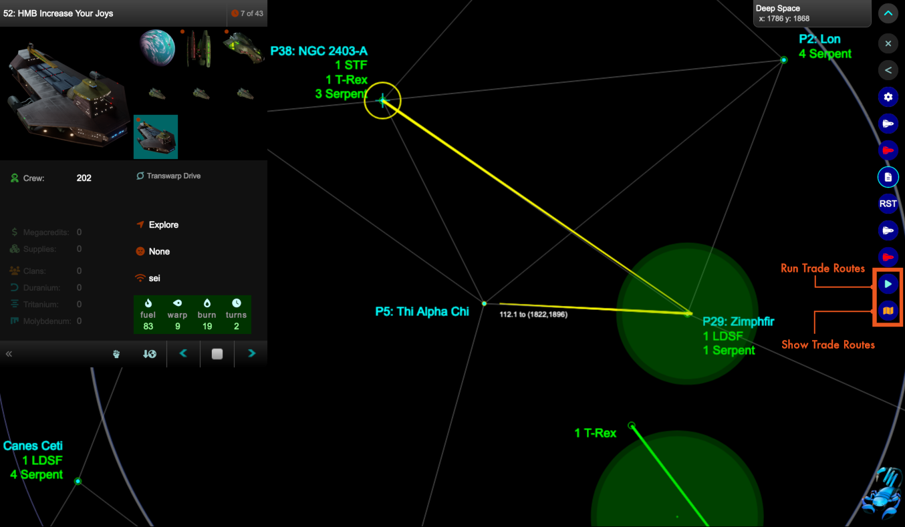
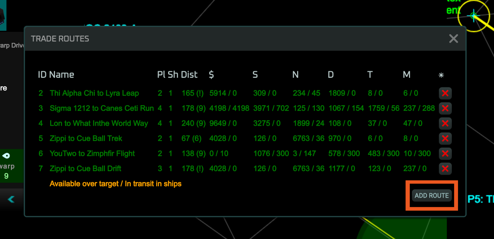
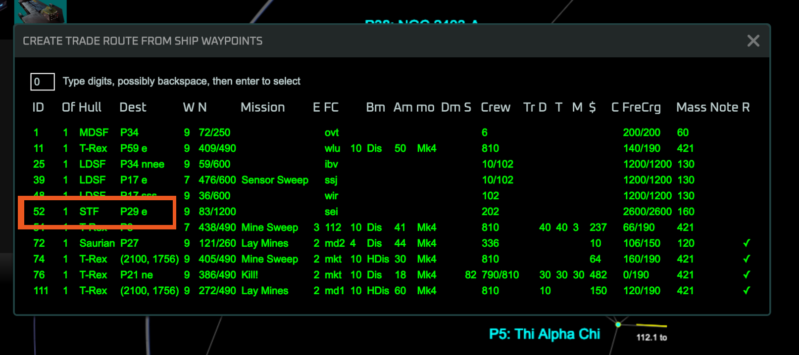
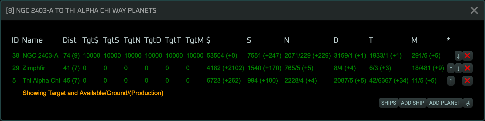
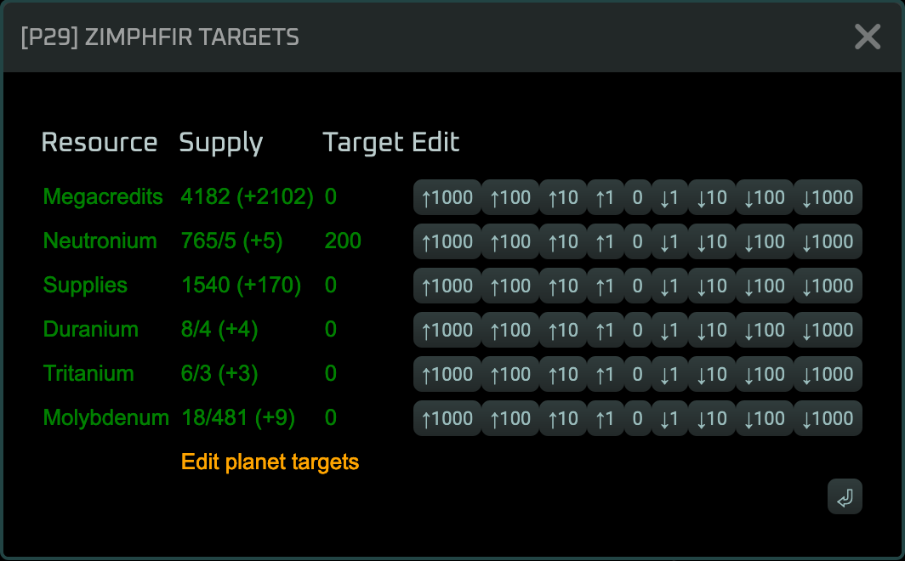

# Kessel Run

Install the [current version](https://raw.githubusercontent.com/j1o1h1n/vgaplanets/refs/heads/main/src/kesselrun.user.js) featuring:

* Create trade routes and assign them to ships
* Manage allocation targets on planets

## How Does This Plugin Help Me?

This plugin allows you to create trade routes and assign them to ships.  Planets on the route are given allocation targets.  The ships will automatically travel between waypoints collecting and delivering cargo according to the allocation targets.

The plugin uses the [McNimble's Planets.NU plugins](https://chmeee.org/#planets.nu/), specifically the [Toollkit](https://chmeee.org/#planets.nu/McNimblesToolkit) and [FleetManagement](https://chmeee.org/#planets.nu/FleetManagement).

## Usage

To create your first trade route, set waypoints from a ship.  Click [Add Trade Route] from the Trade Routes menu and click on the ship id.  This will create a trade route over these planets.  Targets will be set to 10,000 for the first planet and 0 for subsequent planets.  The ship will be assigned to the trade point.

Click the Run Trade Routes button to activate all trade routes.

## Targets

You can set a target for each resource on the planet.  If an assigned ship arrives at the planet and the amount of resource available is greater than the target it will load the excess.  If the amount is less than the target and the ship is carrying that cargo, it will unload cargo.

## Run Trade Routes

Click the aqua colored "Run Trade Routes" button to activate all trade routes.  Assigned ships will have their next waypoint set, will load fuel and cargo, or set down cargo according to the targets and have their ready tick set.

### Example

I am adding a trade route from P38 -> P29 -> P5.  All trade routes are round trips, on reaching the last planet, a ship will go to the start.  I have selected a ship, S52, and set two waypoints.

Then I click the "Show Trade Routes" button.  This displays a dialog with the current trade routes.

Here click "ADD ROUTE".  This displays a list of ships, I click S52.

View the targets set for the route.

Edit the targets for the route.

